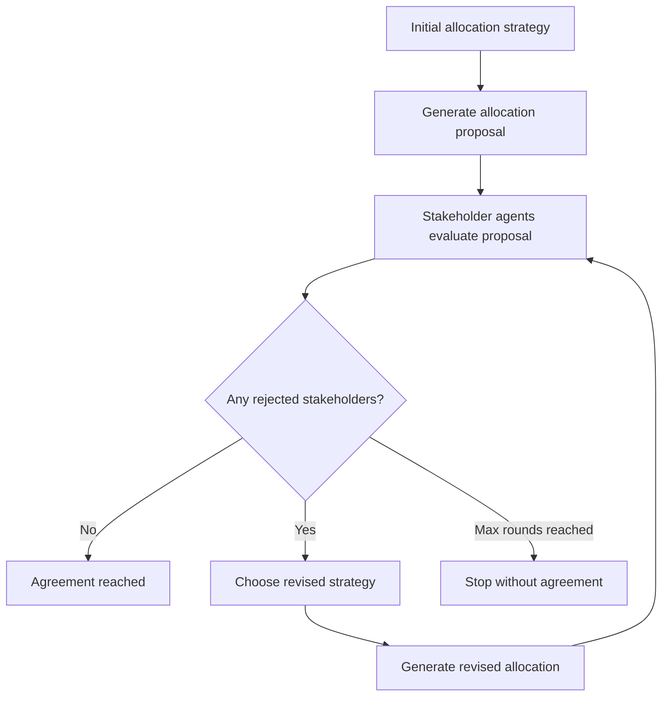

# WaterAgentLab Agents and Negotiation

WaterAgentLab includes simple rule-based stakeholder agents and deterministic negotiation loops.

The goal is to model how different stakeholders respond to water-allocation proposals during drought.

Current agents are not LLM agents. They are deterministic rule-based agents designed to be transparent, testable, and reproducible.

---

## What is an agent in WaterAgentLab?

In WaterAgentLab, an agent represents one stakeholder.

Example stakeholders include:

```text
agriculture
urban
industry
ecosystem
```

Each stakeholder agent receives an allocation proposal and decides whether the proposal is acceptable.

The agent does not change the allocation directly. It evaluates the allocation and returns a structured response.

---

## Agent input

Each agent uses information from two sources.

From the scenario config:

```text
stakeholder name
requested water
minimum acceptable water
priority
```

From the allocation proposal:

```text
allocated water
```

Example:

```text
stakeholder: ecosystem
requested_water: 20
minimum_acceptable_water: 18
allocated_water: 15.38
```

---

## Agent output

Each agent returns a `StakeholderResponse`.

The response contains:

```text
stakeholder_name
requested_water
minimum_acceptable_water
allocated_water
satisfaction_ratio
status
message
```

Example:

```text
stakeholder_name: ecosystem
allocated_water: 15.38
requested_water: 20.0
minimum_acceptable_water: 18.0
satisfaction_ratio: 0.769
status: rejected
message: ecosystem rejects the proposal because allocated water is below the minimum acceptable level.
```

---

## Response statuses

Each stakeholder response has one of three statuses.

| Status | Meaning |
|---|---|
| `accepted` | The stakeholder receives an allocation close to its requested demand. |
| `concerned` | The stakeholder receives at least its minimum acceptable water, but less than its requested demand. |
| `rejected` | The stakeholder receives less than its minimum acceptable water. |

---

## Rule-based agent logic

The current rule-based logic is:

```text
if allocated_water < minimum_acceptable_water:
    status = rejected

else if allocated_water / requested_water < 0.9:
    status = concerned

else:
    status = accepted
```

This means:

```text
below minimum threshold -> rejected
above minimum but below desired request -> concerned
close to full request -> accepted
```

The `0.9` threshold is a simple rule. It means that a stakeholder is considered fully satisfied if it receives at least 90% of its requested water.

---

## Why use rule-based agents first?

WaterAgentLab uses rule-based agents before LLM agents because rule-based agents are:

```text
deterministic
easy to test
easy to debug
transparent
reproducible
```

This makes them a good foundation for future LLM-powered stakeholder simulations.

---

## Relationship between agents and metrics

The agent system is connected to the evaluator metrics.

If a stakeholder receives less than its minimum acceptable water, then:

```text
agent status = rejected
```

At the metric level, this contributes to:

```text
conflict_score
```

Example:

```text
4 stakeholders total
2 stakeholders below minimum
conflict_score = 2 / 4 = 0.5
```

So:

```text
conflict_score > 0
```

means at least one stakeholder should reject the proposal.

---

## Simple negotiation

The simple negotiation command is:

```bash
uv run water-agent-lab negotiate --config configs/drought_mvp.yaml --strategy proportional
```

The logic is:

```text
1. Run the initial strategy.
2. Ask stakeholder agents to evaluate the proposal.
3. If nobody rejects, keep the proposal.
4. If at least one stakeholder rejects, revise using minimum-first.
5. Evaluate stakeholder responses again.
```

This creates the first interaction between allocation strategies and stakeholder agents.

---

## Multi-round negotiation

The multi-round negotiation command is:

```bash
uv run water-agent-lab negotiate-multi --config configs/drought_mvp.yaml --strategy proportional
```

The loop is:

```text
1. Generate allocation proposal.
2. Collect stakeholder responses.
3. Check rejected stakeholders.
4. If no stakeholders reject, stop with agreement.
5. If stakeholders reject, choose a revised strategy.
6. Repeat until agreement or max_rounds is reached.
```

---

## Multi-round negotiation flow



---

## Revision strategy logic

Current revision rules are simple:

| Current strategy | Revised strategy |
|---|---|
| `proportional` | `minimum-first` |
| `priority` | `minimum-priority` |
| `minimum-first` | `minimum-first` |
| `minimum-priority` | `minimum-priority` |

The idea is:

```text
If stakeholders reject a proposal, move toward a strategy that protects minimum acceptable water.
```

Example:

```text
Round 1: proportional
urban rejects
ecosystem rejects

Round 2: minimum-first
no stakeholder rejects
agreement reached
```

---

## When negotiation cannot succeed

Negotiation cannot always reach agreement.

Example:

```text
available_water = 60
total_minimum_required = 96
```

In this case, even `minimum-first` cannot satisfy every stakeholder's minimum acceptable water.

The system should not falsely claim agreement.

Instead:

```text
agreement_reached = False
conflict_score > 0
```

This is realistic because some drought scenarios are too severe to satisfy all minimum needs.

---

## Negotiation history

Multi-round negotiation can save a full JSON history:

```bash
uv run water-agent-lab negotiate-multi \
  --config configs/drought_mvp.yaml \
  --strategy proportional \
  --output outputs/negotiation_history.json
```

The saved history includes:

```text
scenario name
initial strategy
agreement status
rounds used
strategy used in each round
stakeholder responses in each round
rejected stakeholders in each round
evaluation metrics in each round
```

This is useful for debugging, reporting, and future LLM-agent analysis.

---

## Current limitations

The current agents are simple.

They do not yet model:

```text
strategic bargaining
coalition formation
economic loss
legal constraints
long-term ecological damage
human health priority
uncertainty
memory across negotiations
stakeholder personality
natural language argumentation
```

The current negotiation loop also uses fixed revision rules rather than learned or optimized negotiation policies.

---

## Future LLM-agent extension

In a future version, stakeholder agents could be extended with LLM-based behavior.

For example, an LLM stakeholder agent could generate:

```text
a natural language objection
a justification based on stakeholder goals
a counterproposal
a compromise offer
```

However, the deterministic rule-based system should remain as a baseline.

A useful future architecture would be:

```text
rule-based evaluator
+ deterministic metrics
+ LLM-generated stakeholder explanations
```

This keeps the system measurable and reproducible while adding richer interaction.