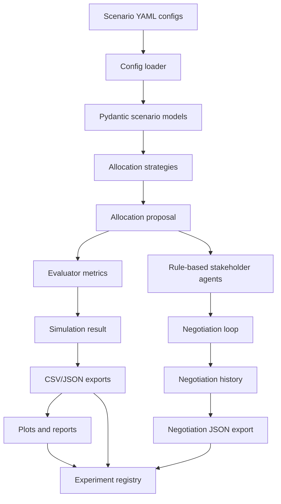
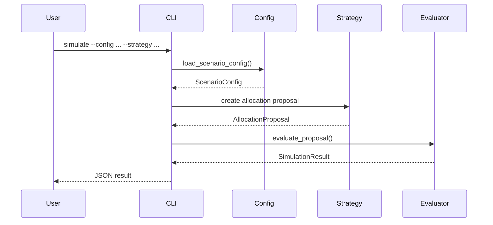
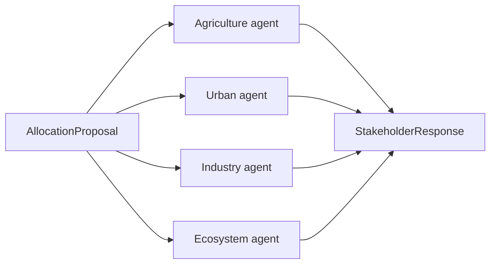
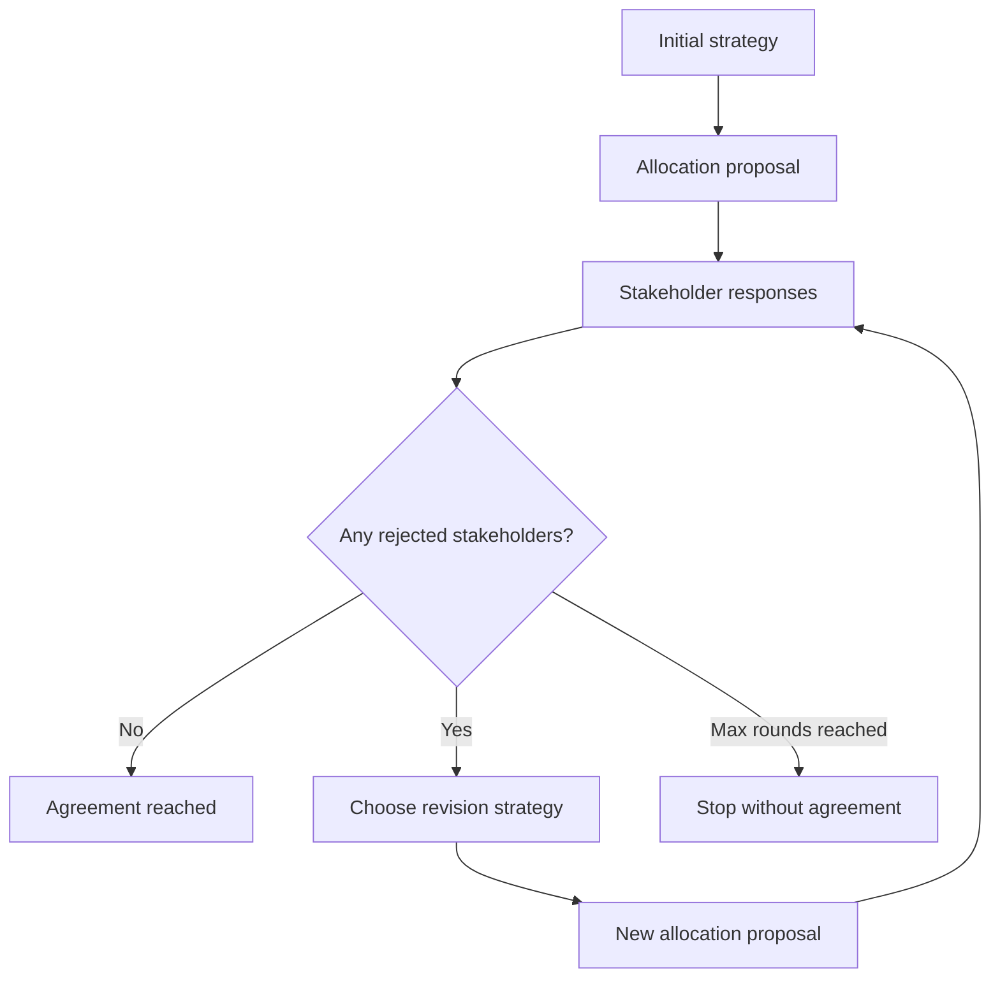
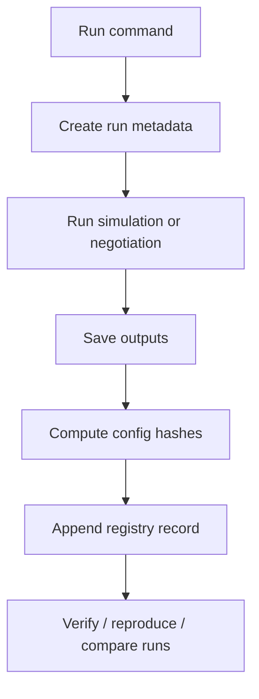
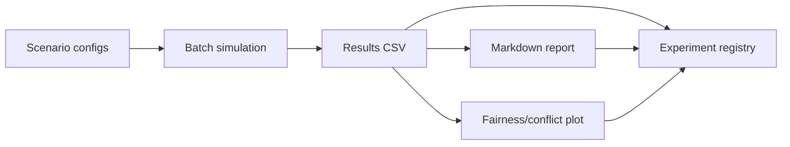

# WaterAgentLab Architecture

WaterAgentLab is a simulation and experiment framework for studying water-resource allocation during drought.

The project models a drought scenario, applies deterministic allocation strategies, evaluates outcomes, collects stakeholder responses, and records experiment metadata for reproducibility.

## High-level architecture



## Core data flow

A typical simulation follows this flow:



## Main components

| Component | File | Responsibility |
|---|---|---|
| Config loader | `config.py` | Loads and validates scenario YAML files. |
| Data models | `models.py` | Defines scenario, stakeholder, allocation, and simulation result models. |
| Strategies | `strategies.py`, `simulator.py` | Provides deterministic allocation baselines. |
| Evaluator | `evaluator.py` | Computes fairness, conflict, satisfaction, shortage, and agreement metrics. |
| Agents | `agents.py` | Produces rule-based stakeholder responses. |
| Negotiation | `negotiation.py` | Runs simple and multi-round negotiation loops. |
| Exporter | `exporter.py` | Saves CSV and JSON outputs. |
| Plotter | `plotter.py` | Generates fairness/conflict plots. |
| Reporting | `reporting.py` | Generates Markdown experiment reports. |
| Registry | `experiment_registry.py` | Records experiment metadata and output paths. |
| Reproducibility | `hashing.py`, `reproduction.py`, `run_comparison.py` | Tracks config hashes, reproduces runs, and compares outputs. |
| Project health | `doctor.py` | Checks whether the project is ready to run. |
| CLI | `cli.py` | Exposes the user-facing commands. |

## Allocation strategies

WaterAgentLab currently supports four deterministic allocation strategies.

| Strategy | Command name | Description |
|---|---|---|
| Proportional | `proportional` | Allocates water proportional to requested demand. |
| Priority-weighted | `priority` | Allocates water by requested demand multiplied by stakeholder priority. |
| Minimum-first | `minimum-first` | Satisfies minimum acceptable water first, then distributes the remainder. |
| Minimum-priority | `minimum-priority` | Satisfies minimums first, then distributes remaining water using priority-weighted unmet demand. |

These strategies are deterministic baselines. They provide a stable reference before adding more complex rule-based or LLM-based negotiation.

## Agent architecture

Stakeholder agents evaluate allocation proposals.



Each agent returns one of three statuses:

| Status | Meaning |
|---|---|
| `accepted` | The allocation is close to requested demand. |
| `concerned` | The allocation is above minimum acceptable water but below requested demand. |
| `rejected` | The allocation is below minimum acceptable water. |

## Negotiation loop

The multi-round negotiation system uses stakeholder responses to revise the allocation strategy.



The current revision rules are simple:

| Current strategy | Revised strategy |
|---|---|
| `proportional` | `minimum-first` |
| `priority` | `minimum-priority` |
| `minimum-first` | `minimum-first` |
| `minimum-priority` | `minimum-priority` |

## Experiment tracking

WaterAgentLab includes lightweight experiment tracking.



Each recorded run can include:

```text
run_id
created_at_utc
command
status
config paths
config hashes
output paths
```

This allows the project to support:

```text
list-runs
show-run
verify-run
reproduce-run
compare-runs
dashboard
```

## End-to-end workflow

The easiest way to run the full experiment pipeline is:

```bash
uv run water-agent-lab run-experiment
```

This command runs:



For a quick demo, run:

```bash
uv run water-agent-lab demo
```

The LLM backend layer supports multiple implementations. The default test backend is `MockLLMBackend`; an optional `QwenLocalBackend` can be used locally for real model inference without changing the agent interface.

## Current limitations

WaterAgentLab currently uses synthetic drought scenarios. It does not yet use real hydrological data, legal restriction data, or LLM-based stakeholder negotiation.

The current agent system is deterministic and rule-based. This is intentional: it provides a reliable and testable foundation before adding more complex agent behavior.

## Future extensions

Planned directions include:

1. Real drought and hydrological data integration.
2. More sophisticated stakeholder utility functions.
3. Richer negotiation policies.
4. LLM-based stakeholder agents.
5. Experiment tracking integration with MLflow or Weights & Biases.
6. Web dashboard or Streamlit demo.